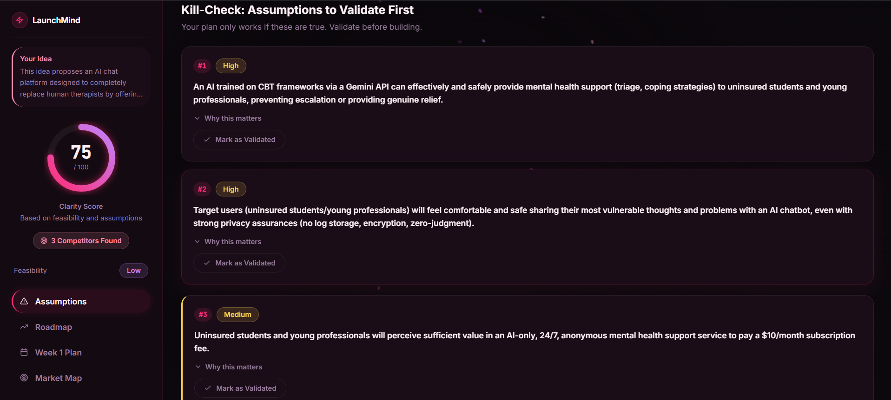

<div align="center">
  <br />
  <h1>🚀 LaunchMind</h1>
  <p>
    <strong>AI-Powered Startup Idea Validator & Execution Engine</strong>
  </p>
  <p>
    Turn your vague ideas into a structured 90-day execution roadmap. Powered by Gemini 2.5 Flash and real-time web scraping, LaunchMind simulates the experience of pitching to a ruthless Silicon Valley VC — forcing you to validate your assumptions before you write a single line of code.
  </p>
  <br />
</div>

## ✨ Key Features

- **🔥 Roast Mode**: Get your idea grilled by an AI acting as a ruthless PM or VC. It asks the tough clarifying questions you probably forgot to ask yourself.
- **🌐 Live Market Analysis**: Instantly scrapes the web (via DuckDuckGo) to identify live competitors, analogies, and unique differentiators.
- **⚡ Execution Roadmap**: Automatically generates a phased 30/60/90-day execution plan.
- **🎯 Assumption Mapping**: Identifies the top 3 critical assumptions that could kill your idea and provides a concrete "Day 1" action to validate them.
- **🎨 Premium UI/UX**: Built with React, Tailwind CSS, Framer Motion, and a meticulously crafted glassmorphism design system.

---

## 📸 Screenshots

Here is a glimpse of LaunchMind in action:

### 1. Landing Page
The entry point, featuring a dynamic cherry blossom canvas and premium staggered animations.


### 2. Idea Input
Where the magic starts. Just drop in a single sentence about your idea.


### 3. The Roast (Clarifying Questions)
AI interrogates your idea to surface hidden complexities.


### 4. Assumption Mapping
Identify and validate the assumptions that could make or break your startup.


### 5. Execution Roadmap
Your 90-day plan broken down into actionable milestones.


---

## 🛠️ Tech Stack

### Frontend
- **Framework**: [React](https://reactjs.org/) + [Vite](https://vitejs.dev/)
- **Styling**: [Tailwind CSS](https://tailwindcss.com/) + Custom Glassmorphism UI
- **Animations**: [Framer Motion](https://www.framer.com/motion/)
- **Icons**: [Lucide React](https://lucide.dev/)

### Backend
- **Framework**: [FastAPI](https://fastapi.tiangolo.com/) (Python)
- **AI Engine**: Google Gemini 2.5 Flash via `google-generativeai`
- **Search**: DuckDuckGo Search API for live market data
- **Validation**: Pydantic

---

## 🚀 Getting Started

### Prerequisites
- Node.js (v18+)
- Python (3.9+)
- A [Google Gemini API Key](https://aistudio.google.com/)

### 1. Backend Setup

Navigate to the backend directory and install dependencies:

```bash
cd launchmind-backend
pip install -r requirements.txt
```

Set up your environment variables:
```bash
cp .env.example .env
```
*Open `.env` and paste your Gemini API key.*

Start the backend server:
```bash
uvicorn main:app --reload
# Server runs on http://localhost:8000
```

### 2. Frontend Setup

Open a new terminal, navigate to the frontend directory, and install dependencies:

```bash
cd frontend
npm install
```

Start the Vite development server:
```bash
npm run dev
# App runs on http://localhost:5173
```

---

## 🔒 Security Note
This project uses a `.gitignore` specifically configured to prevent `.env` files, API keys, and build artifacts from being committed to the repository. Always ensure your keys remain local!

---

<div align="center">
  <p>Built with ❤️ for Builders.</p>
</div>
